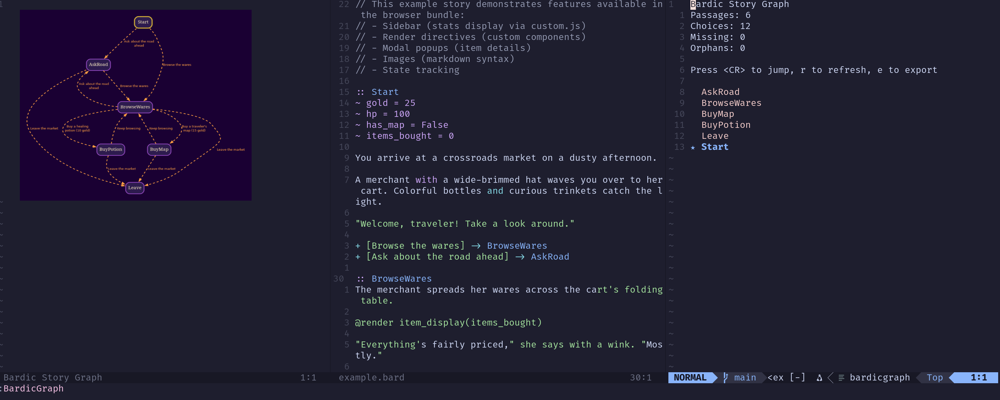

# nvim-bardic

Neovim support for [Bardic](https://github.com/katelouie/bardic), the
Python-first interactive fiction engine and authoring system.

`nvim-bardic` uses the Neovim filetype `bardic` for `.bard` files.



## Features

- `.bard` file detection as `bardic`.
- Syntax highlighting for passages, choices, jumps, directives, control flow,
  imports, expressions, comments, and embedded Python blocks.
- Passage folding.
- VSCode-compatible JSON snippets in `snippets/bardic.json`.
- Bardic CLI integration:
  - `:BardicCompile`
  - `:BardicLint`
- Story graph view:
  - Graphviz-rendered PNG/SVG output.
  - Optional inline display through `image.nvim`.
  - Companion passage index buffer for jump-to-source navigation.
  - Missing and orphan passage indicators.
  - Refresh and export mappings/commands.
  - Simple parser fallback when the Bardic CLI is unavailable or strict
    compilation fails because of missing passage targets.
- Live passage preview through Bardic's Python runtime, with optional JSON state
  injection, choice navigation, reset, and state editing.

## Installation

### Neovim built-in package manager: `vim.pack.add()`

```lua
vim.pack.add({
  { src = "https://github.com/feoh/nvim-bardic" },
})

require("bardic").setup()
```

With image support:

```lua
vim.pack.add({
  { src = "https://github.com/3rd/image.nvim" },
  { src = "https://github.com/feoh/nvim-bardic" },
})

require("image").setup()
require("bardic").setup()
```

### lazy.nvim

```lua
{
  "feoh/nvim-bardic",
  ft = "bardic",
  dependencies = {
    -- Optional, for inline graph images:
    "3rd/image.nvim",
  },
  config = function()
    require("bardic").setup()
  end,
}
```

### packer.nvim

```lua
use({
  "feoh/nvim-bardic",
  requires = {
    -- Optional, for inline graph images:
    "3rd/image.nvim",
  },
  config = function()
    require("bardic").setup()
  end,
})
```

### vim-plug

```vim
Plug '3rd/image.nvim'
Plug 'feoh/nvim-bardic'
```

Then in Lua config:

```lua
require("image").setup()
require("bardic").setup()
```

### Manual package install

```bash
git clone https://github.com/feoh/nvim-bardic \
  ~/.local/share/nvim/site/pack/plugins/start/nvim-bardic
```

## Requirements

- Neovim 0.10+.
- Graphviz `dot` for graph image rendering.
- Bardic CLI/runtime for compile, lint, and live preview features.

Recommended Bardic install with `uv`:

```bash
uv tool install bardic
```

For live preview, `python_cmd` must point at a Python interpreter that can
`import bardic`. If you installed Bardic as a uv tool, that is usually the
interpreter in the tool environment, for example:

```lua
require("bardic").setup({
  python_cmd = vim.fn.expand("~/.local/share/uv/tools/bardic/bin/python"),
})
```

If Bardic is installed in a project virtual environment, set `python_cmd` to
that environment's Python.

## Configuration

```lua
require("bardic").setup({
  bardic_cmd = "bardic",
  python_cmd = nil,
  timeout_ms = 10000,
  prefer_cli = true,
  auto_refresh_graph = true,
  quickfix = true,
  graph = {
    format = "png",
    image_backend = "auto",
    split = "vsplit",
    index_split = "split",
    index_width = 34,
    use_image_nvim = true,
    open_command = nil,
  },
  preview = {
    split = "vsplit",
    state = {},
  },
})
```

## Commands

### `:BardicCompile [file]`

Compile a `.bard` file with the Bardic CLI. Errors are sent to the quickfix
list when possible.

### `:BardicLint [file]`

Run `bardic lint` and populate the quickfix list with reported output.

### `:BardicGraph [file]`

Open the story graph. The plugin first tries Bardic's compiler for accurate
story data. If that is unavailable or compilation fails because the story has
missing targets, it falls back to a local parser so broken links can still be
visualized.

Graph buffer mappings:

- `r` — refresh graph.
- `e` — export graph.

Index buffer mappings:

- `<CR>` — jump to the selected passage.
- `r` — refresh graph.
- `e` — export graph.

### `:BardicGraphRefresh`

Refresh the current story graph.

### `:BardicGraphExport [path]`

Export the current story graph. If no path is supplied, the plugin prompts for
one. The output format is controlled by `graph.format`.

### `:BardicPreview [json-state]`

Preview the passage under the cursor. Optional JSON state can be provided as the
command argument:

```vim
:BardicPreview {"hp": 10, "has_key": true}
```

Preview buffer mappings:

- `<CR>` on a choice line — choose that option.
- `r` — reset the engine.
- `e` — edit injected state JSON.
- `q` — close the preview.

## Snippets

VSCode-style snippets are provided in `snippets/bardic.json` for snippet engines
that can consume JSON snippets. They include:

- `if`, `ifel`, `iff`
- `for`
- `choice`, `cchoice`
- `start`
- `metadata`
- `passage`

## Troubleshooting

### Graph opens as text instead of an image

Install and configure `image.nvim`, use a graphics-capable terminal, and ensure
Graphviz `dot` is installed. The text fallback still reports the rendered image
path and graph stats.

### `:BardicPreview` says Bardic is not installed

Set `python_cmd` to a Python interpreter that can import Bardic. The `bardic`
CLI executable and the Python interpreter used for preview may be different.

### Missing targets prevent compilation

This is expected behavior from Bardic's compiler. `:BardicGraph` falls back to a
simple parser in this case so missing passages are still visible.

## License

MIT
